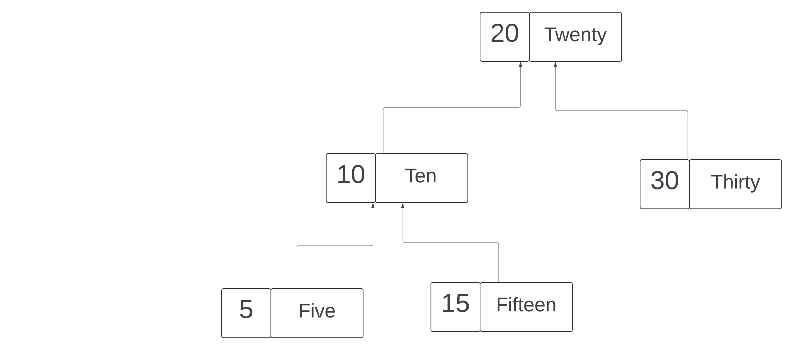

# The Lowest Common Ancestor (LCA)




[Video](https://vimeo.com/936791979/6523a99fbf?share=copy)
### Understanding the Problem
The Lowest Common Ancestor (LCA) of two nodes in a Binary Search Tree (BST) is the lowest node that has both nodes as descendants (where we allow a node to be a descendant of itself).

### Conceptualizing the Task
Given a BST and two node values (keys), the task is to find the LCA. This involves navigating the tree based on the comparison of node values, moving either left or right through the tree, starting from the root.

### Step-by-Step Explanation and Code Implementation

1. **Starting the Function**:
   - Define the function `findLCA(key1, key2)` inside the `BinarySearchTree` class, where `key1` and `key2` are the keys of the two nodes you're trying to find the LCA for.

2. **Initialization**:
   - Begin at the root of the BST. Assign `this` (current instance of the Binary Search Tree) to `currentNode` because the method begins execution from the root node.

3. **Traversal Loop**:
   - Start a `while` loop that continues as long as `currentNode` is not `null`. This ensures the search continues until you either find the LCA or exhaust all nodes (exit the tree structure).

4. **Navigating the Tree**:
   - Inside the loop, check the following conditions for the current node’s key:
     - If `currentNode.key` is greater than both `key1` and `key2`, then both nodes are in the left subtree. Set `currentNode` to `currentNode.left` to continue searching there.
     - Conversely, if `currentNode.key` is less than both `key1` and `key2`, then both nodes are in the right subtree. Thus, set `currentNode` to `currentNode.right`.
     - If neither condition is met, it means that `currentNode` is the split point where one key is on the left and the other is on the right (or one of the keys equals `currentNode.key`), which makes the `currentNode` the LCA.

5. **Returning the Result**:
   - If the loop exits without finding the LCA (which theoretically shouldn't happen in a proper BST if both keys exist in the tree), return `null`.
   - If the conditions inside the loop determine the LCA, return `currentNode`.

6. **Creating and Testing the Tree**:
   - Instantiate a `BinarySearchTree` and insert the relevant nodes.
   - Call the `findLCA` method with two keys, such as 5 and 15, and print the result.

### JavaScript Code Snippet

```javascript
class BinarySearchTree {
  constructor() {
    this.root = null;
  }

  // Additional methods like insert() to populate the tree might be here

  findLCA(key1, key2) {
    let currentNode = this.root; // assuming we start from the root
    while (currentNode != null) {
      if (currentNode.key > key1 && currentNode.key > key2) {
        currentNode = currentNode.left;
      } else if (currentNode.key < key1 && currentNode.key < key2) {
        currentNode = currentNode.right;
      } else {
        return currentNode; // Found the LCA
      }
    }
    return null; // If no LCA found
  }
}

// Example of creating a tree and finding the LCA
const bst = new BinarySearchTree();
// Assume insert method correctly sets up the tree
bst.insert(20, 'Twenty');
bst.insert(10, 'Ten');
bst.insert(30, 'Thirty');
bst.insert(5, 'Five');
bst.insert(15, 'Fifteen');

const lca = bst.findLCA(5, 15);
console.log("LCA of 5 and 15:", lca.key);  // Should output: LCA of 5 and 15: 10
```

This guide covers the logical steps taken from the conceptual discussion through the implementation in code, focusing on traversing a BST to find the Lowest Common Ancestor of two given nodes.